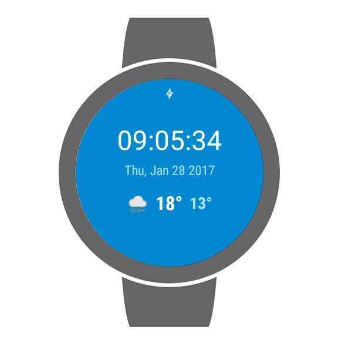
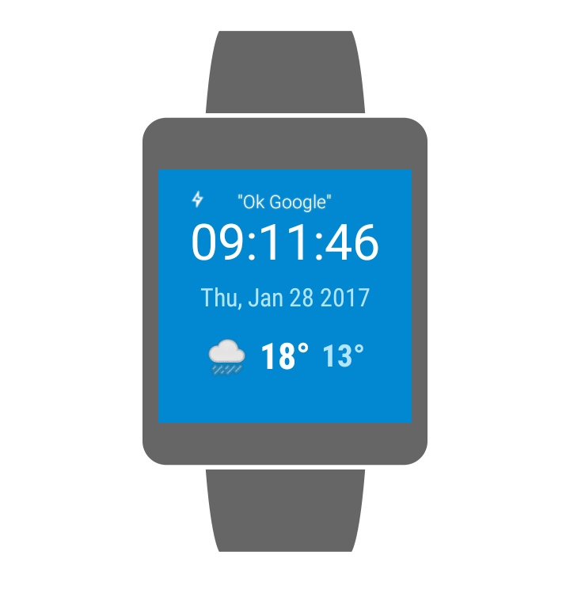
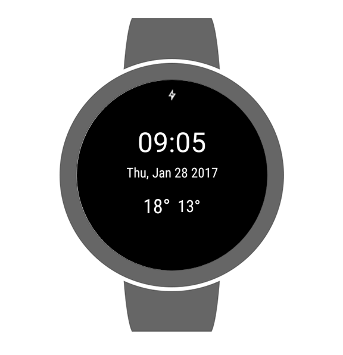
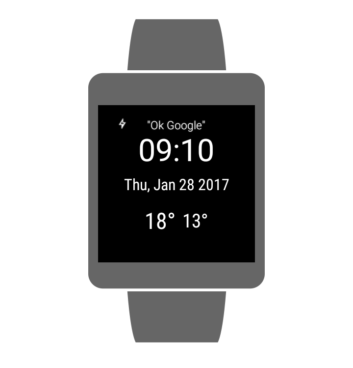

# Go Ubiquitous (Sunshine WatchFace for Android Wear ) 

Go Ubiquitous is Project 6 for my Android NanoDegree Program from [Udacity](https://www.udacity.com/)

## Building

Clone and import into Android Studio, That's it.

## SDK version

##### Handheld

    minSdkVersion 19
    targetSdkVersion 25

#### Wear

    minSdkVersion 21
    targetSdkVersion 25

## Screenshots

